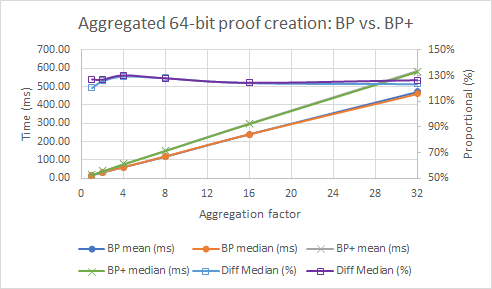
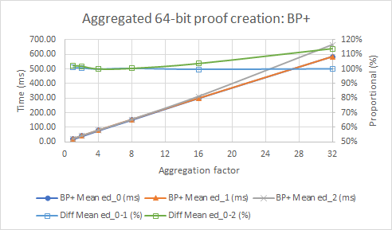
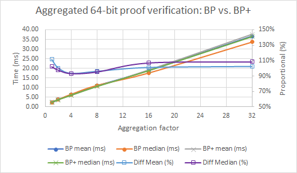
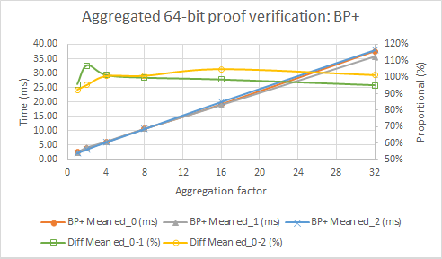
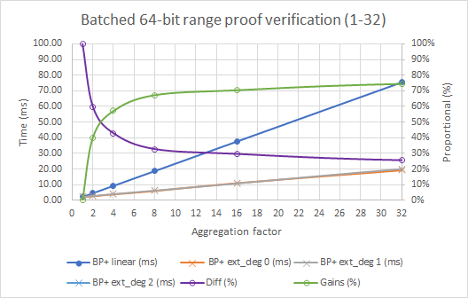
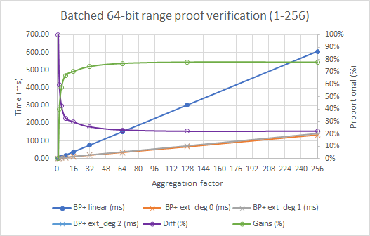
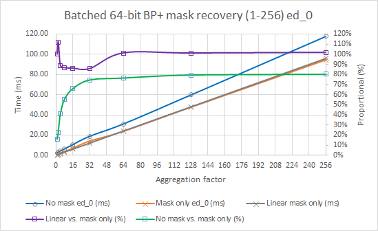

[](https://circleci.com/gh/tari-project/tari/tree/development)


[](https://coveralls.io/github/tari-project/bulletproofs-plus?branch=main)


# Tari Bulletproofs+

## Overview

Tari Bulletproofs+ (BP+) implements _Bulletproofs+: Shorter Proofs for Privacy-Enhanced Distributed Ledger_ [2],  
derived from the original Bulletproofs (BP) work _Bulletproofs: Short Proofs for Confidential Transactions and More_ 
[1]. The former offers a 96 bytes shorter proof size than the latter.

## Comparative performance

As we intend to move from Bulletproofs [1] to Bulletproofs+ [2] in our 
[blockchain project](https://github.com/tari-project), the natural benchmark comparison is with the experimental results 
in [2] and Dalek's Bulletproofs [4]. Compared with Dalek's Bulletproofs, our average proof creation is 30% slower, 
while verification is on par. Compared with the experimental results in [2], we could not recreate the 16% reduction in 
prover time; however, our 1% increase in verification time is on par with their 3%. Immediate benefits are evident 
when employing batch verification; exponential gains range from 37% to 79% for batch sizes from 2 to 256 proofs.

Extended commitments add virtually no overhead in single or aggregated range proof creation or verification time, 
neither in batched verification time nor when compared to regular Pedersen commitments.

Mask/blinding factor recovery adds moderate (5% for single proof-verification with extension degree zero) to significant 
(22% for 256 single batched proofs verification with extension degree two) overhead to verification performance; 
comparisons below were made without activating the recovery feature. Deactivating proof verification for a 
"mask-recovery-only" mode of operation is possible and omits the expensive multi-exponentiation multiplication, 
resulting in linear performance (as opposed to exponential gains/cost). Batched "mask-recovery-only" is approximately 
10% more costly on average when compared to non-batched recovery. 

**Note:** The test results listed here are relative; the numbers are not absolute. The tests were run on an Intel(R) 
Core(TM) i7-7820HQ CPU laptop without using the `simd_backend` feature.

### Aggregated 64-bit range proof creation

_**Notes:**_
- Median values are used for comparison.
- In the headings and legends:
  - `ed_0` means extension degree zero
  - `ed_1` means extension degree one
  - `ed_2` means extension degree two

#### BP vs. BP+ (creation)

BP+ creation is 30% slower than BP.

| Size | BP Med (ms) | BP+ Med (ms) | Diff Med (%) |
|------|-------------|--------------|--------------|
| 1    | 16.29       | 21.24        | 130%         |
| 2    | 31.63       | 41.08        | 130%         |
| 4    | 60.47       | 80.46        | 133%         |
| 8    | 119.18      | 156.56       | 131%         |
| 16   | 240.18      | 306.03       | 127%         |
| 32   | 460.67      | 598.57       | 130%         |
|      |             | Average      | 130%         |

<p align="center"></p>

#### BP+ extension degrees (creation)

Extended commitments add virtually no overhead to creation time.

| Size | BP+ Med ed_0 (ms) | BP+ Med ed_1 (ms) | BP+ Med ed_2 (ms) | Diff Med ed_0-1 (%) | Diff Med ed_0-2 (%) |
|------|-------------------|-------------------|-------------------|---------------------|---------------------|
| 1    | 21.24             | 21.48             | 22.467            | 101.12%             | 105.77%             |
| 2    | 41.08             | 41.45             | 42.074            | 100.91%             | 102.43%             |
| 4    | 80.46             | 80.70             | 80.76             | 100.31%             | 100.38%             |
| 8    | 156.56            | 157.07            | 157.06            | 100.33%             | 100.32%             |
| 16   | 306.03            | 306.28            | 305.49            | 100.08%             | 99.82%              |
| 32   | 598.57            | 598.47            | 598.01            | 99.98%              | 99.91%              |
|      |                   |                   | Average           | 100%                | 101%                |

<p align="center"></p>

### Aggregated 64-bit range proof verification

#### BP vs. BP+ (verification)

BP+ verification showed gains for smaller aggregation sizes compared to BP, but is slower for larger aggregation sizes.  

| Size | BP Med (ms) | BP+ Med (ms) | Diff Med (%) |
|------|-------------|--------------|--------------|
| 1    | 2.34        | 2.17         | 93%          |
| 2    | 3.76        | 3.71         | 99%          |
| 4    | 6.44        | 6.18         | 96%          |
| 8    | 11.10       | 10.96        | 99%          |
| 16   | 17.57       | 19.52        | 111%         |
| 32   | 33.69       | 36.97        | 110%         |
|      |             | Average      | 101%         |

<p align="center"></p>

#### BP+ extension degrees (verification)

Extended commitments add virtually no overhead to verification time.

| Size | BP+ Med ed_0 (ms) | BP+ Med ed_1 (ms) | BP+ Med ed_2 (ms) | Diff Med ed_0-1 (%) | Diff Med ed_0-2 (%) |
|------|-------------------|-------------------|-------------------|---------------------|---------------------|
| 1    | 2.17              | 2.20              | 2.20              | 102%                | 102%                |
| 2    | 3.71              | 3.74              | 3.76              | 101%                | 101%                |
| 4    | 6.18              | 6.26              | 6.28              | 101%                | 102%                |
| 8    | 10.96             | 11.05             | 10.97             | 101%                | 100%                |
| 16   | 19.52             | 19.66             | 19.51             | 101%                | 100%                |
| 32   | 36.97             | 36.99             | 36.87             | 100%                | 100%                |
|      |                   |                   | Average           | 101%                | 101%                |


<p align="center"></p>

### Batched 64-bit single range proof verification

Batched verification shows significant gains when compared to linear verification. 

| Batch size | BP+ linear (ms) | BP+ ext_deg 0 (ms) | BP+ ext_deg 1 (ms) | BP+ ext_deg 2 (ms) | Diff (%) | Gains (%) |
|------------|-----------------|--------------------|--------------------|--------------------|----------|-----------|
| 1          | 2.17            | 2.17               | 2.18               | 2.20               | 100%     | 0%        |
| 2          | 4.34            | 2.73               | 2.73               | 2.76               | 63%      | 37%       |
| 4          | 8.68            | 3.82               | 3.82               | 3.80               | 44%      | 56%       |
| 8          | 17.36           | 5.74               | 5.76               | 5.75               | 33%      | 67%       |
| 16         | 34.72           | 9.57               | 9.60               | 9.74               | 28%      | 72%       |
| 32         | 69.44           | 17.10              | 17.06              | 17.05              | 25%      | 75%       |
| 64         | 138.89          | 32.04              | 32.06              | 31.85              | 23%      | 77%       |
| 128        | 277.77          | 60.56              | 60.75              | 60.71              | 22%      | 78%       |
| 256        | 555.55          | 118.55             | 118.69             | 119.15             | 21%      | 79%       |

<p align="center"></p>

<p align="center"></p>

### Batched 64-bit single range proof mask recovery

Mask-recovery-only mode is linear and does not benefit from batched operations; batched recovery is suboptimal.

| Batch size | No mask ed_0 (ms) | Mask only ed_0 (ms) | Linear mask only (ms) | Linear vs. mask only (%) | No mask vs. mask only (%) |
| ---------- | ----------------- | ------------------- | --------------------- | ------------------------ | ------------------------- |
| 1          | 2.10              | 0.22                | 0.22                  | 100.0%                   | 10.4%                     |
| 2          | 2.59              | 0.43                | 0.44                  | 102.2%                   | 16.5%                     |
| 4          | 3.59              | 0.90                | 0.87                  | 97.0%                    | 25.0%                     |
| 8          | 5.46              | 1.87                | 1.74                  | 93.4%                    | 34.2%                     |
| 16         | 9.31              | 3.78                | 3.49                  | 92.3%                    | 40.6%                     |
| 32         | 16.54             | 9.31                | 6.97                  | 74.9%                    | 56.3%                     |
| 64         | 30.39             | 15.27               | 13.95                 | 91.3%                    | 50.3%                     |
| 128        | 58.25             | 30.60               | 27.90                 | 91.2%                    | 52.5%                     |
| 256        | 113.18            | 61.36               | 55.80                 | 90.9%                    | 54.2%                     |

<p align="center"></p>

## References

[1] [Bulletproofs: Short Proofs for Confidential Transactions and More](https://eprint.iacr.org/2017/1066/20220414:014622)

[2] [Bulletproofs+: Shorter Proofs for Privacy-Enhanced Distributed Ledger](https://eprint.iacr.org/2020/735/20200618:154806)

## Credits

[3] We used the proof of concept [Python implementation](https://github.com/AaronFeickert/pybullet-plus) by 
    [Aaron Feickert](https://github.com/AaronFeickert) as a verbatim algorithm reference.

[4] We are re-using generators and the transcript protocol from Dalek's
    [Bulletproofs](https://github.com/dalek-cryptography/bulletproofs), which in turn is built on top of Dalek's 
    [group operations on Ristretto and Curve25519](https://github.com/dalek-cryptography/curve25519-dalek).

[5] Another precursor to this work is 
    [Monero's implementation](https://www.getmonero.org/2020/12/24/Bulletproofs+-in-Monero.html) of Bulletproofs+.

## Copyright

All original source code files are marked with
```
Copyright 2022 The Tari Project
SPDX-License-Identifier: BSD-3-Clause
```
All re-used and or adapted `dalek-cryptography` source code files are marked with
```
Copyright 2022 The Tari Project
SPDX-License-Identifier: BSD-3-Clause
  Modified from:
    Copyright (c) 2018 Chain, Inc.
    SPDX-License-Identifier: MIT
```
