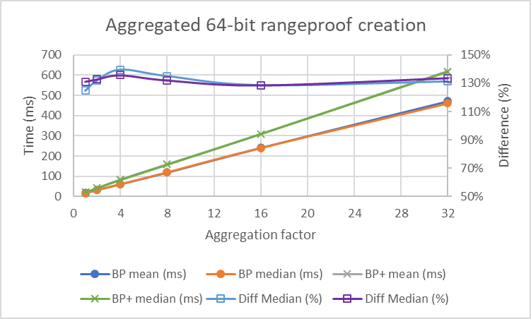
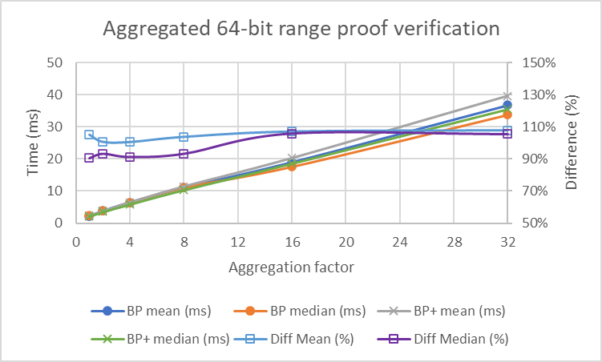
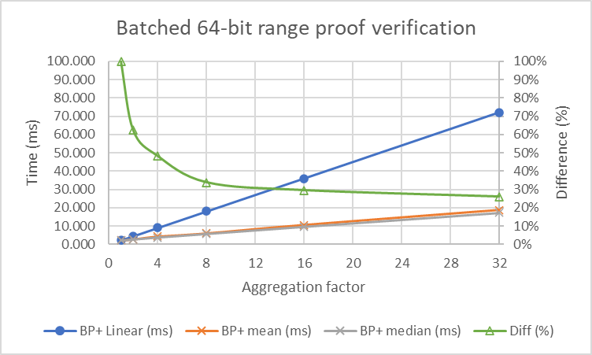

[](https://circleci.com/gh/tari-project/tari/tree/development)

# Tari Bulletproofs+

## Overview

Tari Bulletproofs+ is an implementation of _Bulletproofs+: Shorter Proofs for Privacy-Enhanced Distributed Ledger_ [2], 
which was derived from the original _Bulletproofs: Short Proofs for Confidential Transactions and More_ [1]. The former 
offer a 96 bytes shorter proof size than the latter.

## Comparative performance

As we intend moving from Bulletproofs [1] to Bulletproofs+ [2] in our 
[blockchain poject](https://github.com/tari-project), the natural benchmark comparison is with Dalek's Bulletproofs [4]. 
On average our proof creation and proof verification is respectively 32% and 4% slower, however, employing batch 
verification, immediate benefits are evident with gains ranging from 38% to 74% for batch sizes from 2 to 32 proofs. 
Thus, with our current implementation, we could not recreate the experimental results in [2], which claimed 16% 
reduction in prover time, however, our 4% increase in verification time is exactly on par with their 3%. 

### Aggregated 64-bit rangeproof creation

| Size | BP mean (ms) | BP median (ms) | BP+ mean (ms) | BP+ median (ms) | Diff Mean (%) | Diff Median (%) |
| ---- | ------------ | -------------- | ------------- | --------------- | ------------- | --------------- |
| 1    | 17.15        | 16.29          | 21.41         | 21.36           | 125%          | 131%            |
| 2    | 31.91        | 31.63          | 42.10         | 41.98           | 132%          | 133%            |
| 4    | 60.81        | 60.47          | 84.79         | 82.06           | 139%          | 136%            |
| 8    | 118.53       | 119.18         | 160.02        | 157.31          | 135%          | 132%            |
| 16   | 240.47       | 240.18         | 309.50        | 308.31          | 129%          | 128%            |
| 32   | 471.71       | 460.67         | 619.32        | 615.70          | 131%          | 134%            |

<p align="center"></p>

### Aggregated 64-bit range proof verification

| Size | BP mean (ms) | BP median (ms) | BP+ mean (ms) | BP+ median (ms) | Diff Mean (%) | Diff Median (%) |
| ---- | ------------ | -------------- | ------------- | --------------- | ------------- | --------------- |
| 1    | 2.19         | 2.34           | 2.30          | 2.12            | 105%          | 91%             |
| 2    | 3.75         | 3.76           | 3.79          | 3.51            | 101%          | 93%             |
| 4    | 6.44         | 6.44           | 6.49          | 5.88            | 101%          | 91%             |
| 8    | 11.02        | 11.10          | 11.45         | 10.36           | 104%          | 93%             |
| 16   | 18.94        | 17.57          | 20.27         | 18.60           | 107%          | 106%            |
| 32   | 36.69        | 33.69          | 39.55         | 35.52           | 108%          | 105%            |

<p align="center"></p>

### Batched 64-bit range proof verification

| Size | BP+ Linear (ms) | BP+ mean (ms) | BP+ median (ms) | Diff (%) |
| ---- | --------------- | ------------- | --------------- | -------- |
| 1    | 2.25            | 2.25          | 2.09            | 100%     |
| 2    | 4.50            | 2.80          | 2.65            | 62%      |
| 4    | 9.00            | 4.34          | 3.74            | 48%      |
| 8    | 17.99           | 6.10          | 5.70            | 34%      |
| 16   | 35.99           | 10.64         | 9.64            | 30%      |
| 32   | 71.97           | 18.75         | 17.28           | 26%      |

<p align="center"></p>

## References

[1] [Bulletproofs: Short Proofs for Confidential Transactions and More](https://eprint.iacr.org/2017/1066/20220414:014622)

[2] [Bulletproofs+: Shorter Proofs for Privacy-Enhanced Distributed Ledger](https://eprint.iacr.org/2020/735/20200618:154806)

##Credits

[3] We used the proof of concept [Python implementation](https://github.com/AaronFeickert/pybullet-plus) by 
    [Aaron Feickert](https://github.com/AaronFeickert) as a verbatim algorithm reference.

[4] We are re-using generators and the transcript protocol from Dalek's
    [Bulletproofs](https://github.com/dalek-cryptography/bulletproofs), which in turn is built on top of Dalek's 
    [group operations on Ristretto and Curve25519](https://github.com/dalek-cryptography/curve25519-dalek).

[5] Another pre-cursor to this work is 
    [Monero's implementation](https://www.getmonero.org/2020/12/24/Bulletproofs+-in-Monero.html) of Bulletproofs+.

## Copyright

All original source code files are marked with
```
Copyright 2022 The Tari Project
SPDX-License-Identifier: BSD-3-Clause
```
All re-used and or adapted `dalek-cryptography` source code files are marked with
```
Copyright 2022 The Tari Project
SPDX-License-Identifier: BSD-3-Clause
  Modified from:
    Copyright (c) 2018 Chain, Inc.
    SPDX-License-Identifier: MIT
```
